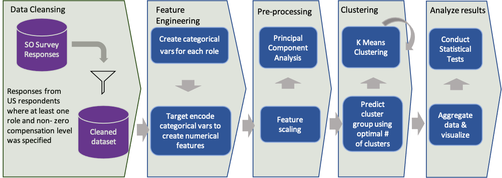
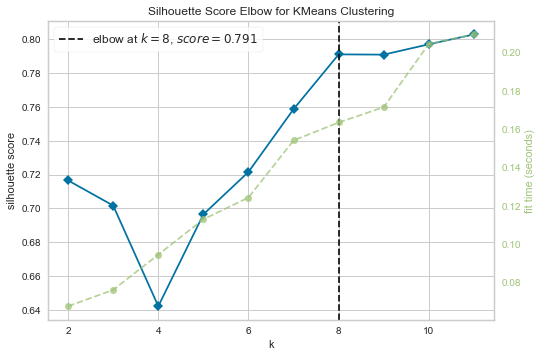

## Table of Contents
====================
* [1. Introduction](https://github.com/pravin096/quant_approach_to_persona_development/blob/main/README.md#1-introduction)
* [2. Project Objectives](https://github.com/pravin096/quant_approach_to_persona_development/blob/main/README.md#2-projectobjectives)
* [3. Methodology](https://github.com/pravin096/quant_approach_to_persona_development/blob/main/README.md#3-methodology)
* [4. Metrics to measure model performance](https://github.com/pravin096/quant_approach_to_persona_development/blob/main/README.md#4-metricstomeasuremodelperformance)
* [9 Visuals from the app](https://github.com/pravin096/quant_approach_to_persona_development/blob/main/README.md#9-visuals-from-the-app)
* [10 Licensing and Acknowledgements](https://github.com/pravin096/quant_approach_to_persona_development/blob/main/README.md#10-licensing-and-acknowledgements)
* [11 Package Requirements and Operating Instructions](https://github.com/pravin096/quant_approach_to_persona_development/blob/main/README.md#11-package-requirements-and-operating-instructions)
    

## 1. Introduction

Information Technology (IT) as an industry and its function within an organization has rapidly evolved over the last 25-30 years. The entry of data science, blockchain and AI has rapidly transformed not only the Technology function within the organization but also transformed business, strategy and decision-making processes within the organization, thus spurring technology-led innovations. Roles and job functions within an organization have and are also rapidly evolving. The last Stackoverflow survey (2020) listed eight different developer roles, out of 23 different roles in the survey. This project explores a quantitative approach to creation of personas of Data Science professionals using 
robust dataset from Stackoverflow's 2020 survey. 
   
 

## 2. Project Objectives

Given the context of the diverse set of roles listed in the Stackoverflow survey 2020, seek answers to following questions using a quantitative approach to analyse the survey data:
I.	What are the distinct personas of professionals surveyed by Stackoverflow, given the diversity of the roles listed and the corresponding goals and objectives both for the organization and the professionals?
II.	How do these personas relate to compensation levels, both, practically and/or statistically?
III.	How do these personas relate to jobsat, both, practically and/or statistically?

## 3. Methodology 
* CRISP-DM (Cross-Industry Standard for Data Mining) https://en.wikipedia.org/wiki/Cross-industry_standard_process_for_data_mining. A diagrammatic representation of the analysis approach is shown below:

## 4. Metrics to measure model performance 
* The metric used to measure clustering model effectiveness is - Silhouette Score.
* Optimum number of clusters determined based on elbow method. In this case it is 8. The silhouette score elbow plot is shown below:
     

## 9 Visuals from the app

 
 <b> Disaster Response API - Main Screen 

 
 

 
 

 
 <b> Sample Message 1 - Classification Result 

 
 

 

 <b> Training Dataset Overview 

 
 

## 9 Results

## 10 Licensing and Acknowledgements
Thanks to Stackoverflow for providing dataset for this project 

## 11 Package Requirements and Operating Instructions
### 11.1 Model Development component (DevelopModel.ipynb)

####   Packages Requirements:
|No.|Package Name|Version #|
|---|------------|---------|
|1|numpy|1.17.0|
|2|pandas|1.1.3|
|3| matplotlib|3.3.4 |
|4| scikitlearn|0.23.2 |
|5| yellowbrick|1.2|
|6| category_encoders|2.2.2| 
|7| pickle|0.7.5 |

Operating Instructions:

* Execute all the cells in the notebook. 

####   The main function when executed will 
- read .csv data in the <strong><em>data </em> </strong> folder 
- create <strong><em>clusterer.pkl</em> </strong> file in the <strong><em>models</em> </strong> folder
- create a <strong><em>us_community_df.csv</em> </strong> dataset in the <strong><em>data </em> </strong> folder

### 11.2 Analyze Roles component (AnalyzeRoles.ipynb)

Package requirements:
|No.|Package Name|Version #|
|---|------------|---------|
|1|numpy|1.17.0|
|2|pandas|1.1.3|
|3| plotly|4.14.3 |
|4| scikitlearn|0.23.2 |
|5| scipy|1.5.2|

Operating Instructions:
* Execute all the cells in the notebook.
